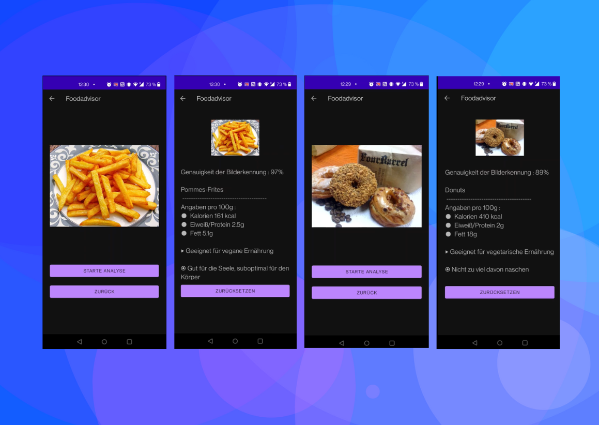

# FoodAdvisor

Android App using Deep Learning to advice food considering an image source

FoodAdvisor-installation.apk serves for direct installation on Android devices

Requirements:
1. Working Custom Tensorflow Model in Python ✅
2. ModelOutput formating ✅
3. Android UI, Behaviour ✅
4. Convert Tensorflow Model to TFLite ✅
5. Integrate TLite Model into Android App ✅

Source Code Guide:

- The UI components are located in:
  .\CameraTest\app\src\main\java\com\example\CameraTest
- The database and the TFLite are located in:
  .\CameraTest\app\src\main\assets